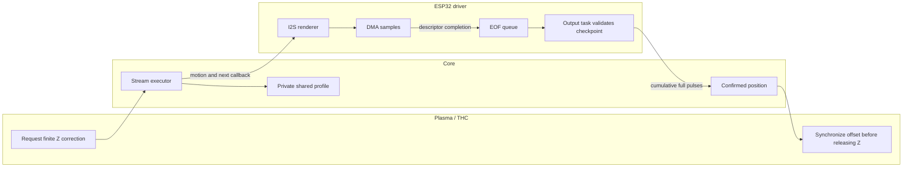
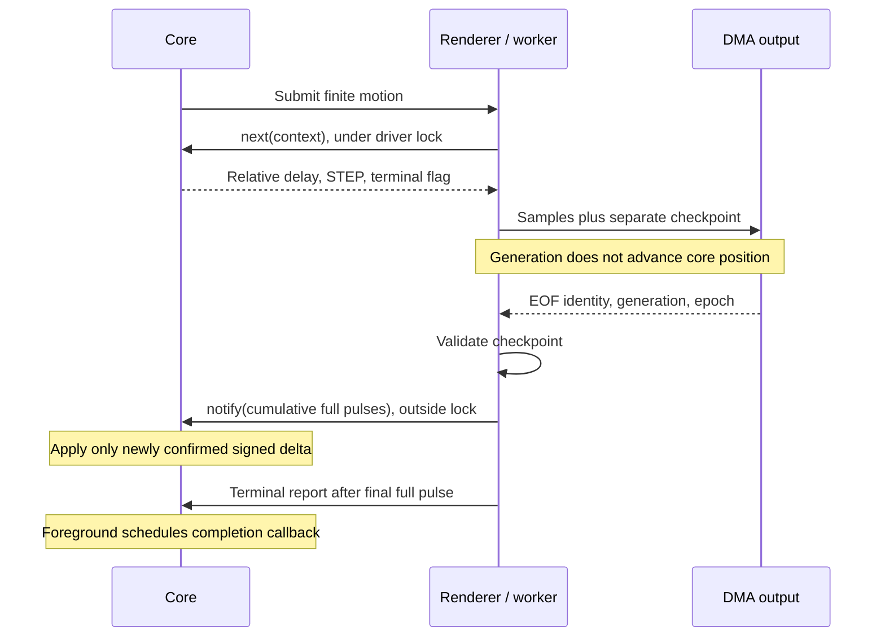
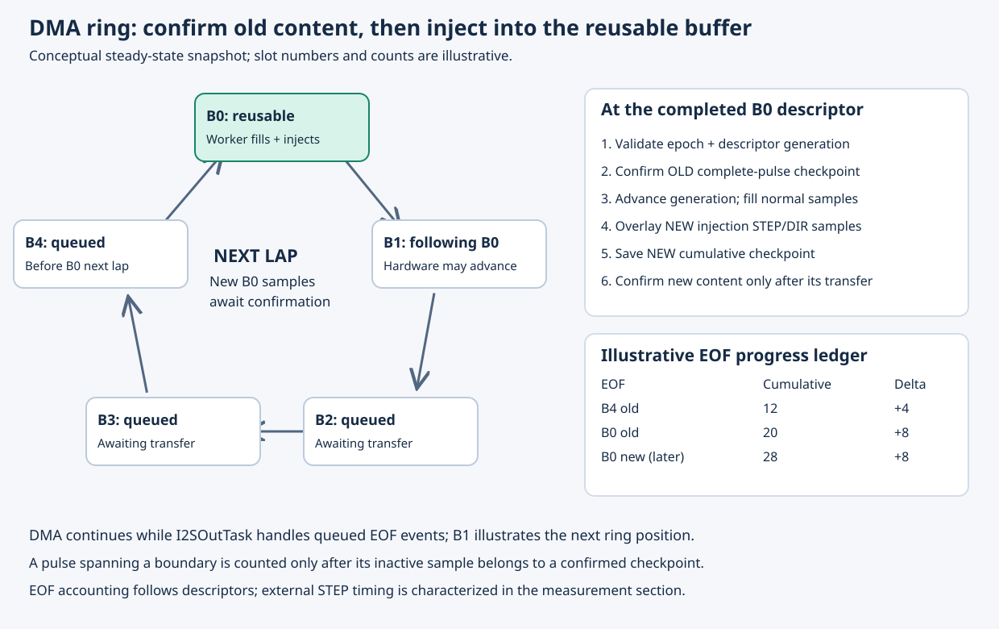
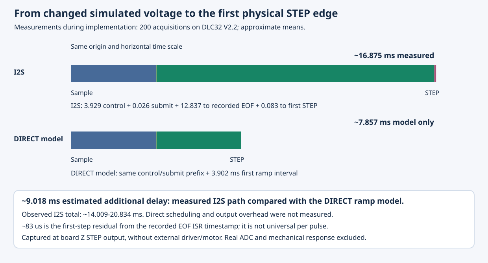

# Finite I2S injection: architecture and integration

During voltage-based torch height control (THC), Plasma requests Z corrections
while the planner continues the XY cutting path. On an I2S output board, STEP
and DIR signals are carried by a stream of samples prepared in DMA buffers.
The secondary motor therefore needs a way to place its correction into that
stream and track the output as the buffers are transferred.

This implementation connects the secondary-stepper motion profile to the ESP32
I2S transport. Core generates the correction's timed step sequence; the driver
places it in available sample buffers and returns completion information.
Plasma uses the confirmed Z offset when handing the axis back to the planner.

Series overview: [ESP32#220](https://github.com/grblHAL/ESP32/issues/220).
Companion changes: [core#1025](https://github.com/grblHAL/core/pull/1025) and
[Plugin_plasma#31](https://github.com/grblHAL/Plugin_plasma/pull/31).

## Design objectives

The first version addresses finite Z corrections, including an explicit single
step, on MKS DLC32 with classic ESP32. Its main objectives are:

- preserve the existing DIRECT timer/polling behavior while sharing one ramp;
- separate advance calculation from output execution and position accounting;
- keep the correction in one motion record with private generator state;
- combine injected Z output with planner motion on the other axes;
- retain motion identity across buffer reuse, completion and reset;
- synchronize the confirmed offset before releasing Z to the planner.

The following sections describe how those decisions fit together. The
[implementation and evidence summary](#implementation-and-evidence-summary)
connects each objective to its code path and validation.

## Architecture across the three repositories

| Repository | Responsibility | Detailed document |
|---|---|---|
| Core | Shared profile, direct/stream executors, generic HAL contract and confirmed position | [Core contract](../main/grbl/doc/stream-injection.md) |
| Plugin_plasma | THC integration and confirmed Z offset before ownership handover | [Plasma handover](../main/plasma/doc/stream-injection.md) |
| ESP32 | Axis ownership, I2S sample rendering, DMA checkpoint validation and output-task notifications | This document |

The linked documents follow the ESP32 repository layout, with core and Plasma
under `main/grbl` and `main/plasma`.

## Why refactoring was required

The original secondary-stepper transition advanced the ramp, emitted a direct
step and updated position together. Preparing future DMA output requires those
operations to be separate: generating a request cannot mean it has already
executed. The profile refactor `dff5583` establishes that separation while
preserving tested DIRECT behavior. Stream support `f628524` then consumes the
same profile ahead of time and accounts for motion from transport confirmation.
See the [before/after refactor diagram](../main/grbl/doc/stream-injection.md#why-the-profile-refactor-comes-first).

## C call path and data boundaries

`st2_motor_move` dispatches to `st2_stream_move`. It submits an
`injection_motion_t` through `hal.stepper.injection`, installed by `driver.c` as
`i2s_motor_injection`. `injection_submit` checks the driver state and Z claim,
then calls `i2s_injection_begin` with output masks and pulse timing.

`i2s_injection_begin` copies the motion record and pulls the first event.
`i2s_injection_render` pulls further events through `st2_stream_next` as reserved
output space becomes available. It overlays only the injected STEP/DIR bits in
samples produced by the normal I2S path. The driver serializes the portable
renderer; the renderer contains no internal lock.

The EOF interrupt handler `i2s_out_intr_handler()` queues descriptor identity,
generation and the DMA stream renewal identifier (`epoch`). The FreeRTOS task
named `I2SOutTask`, implemented by
`i2sOutTask()` in `i2s_out.c`, validates these against the sidecar checkpoint and calls
`i2s_injection_confirm`. This output task releases the driver lock before invoking the motion's
`notify` callback (`st2_stream_progress`). Core validates motion identity and
counts, updates signed position, and services successful completion from its
foreground path.

| Data | Owner and visibility |
|---|---|
| `st2_profile_t` and executor flags | Private core implementation |
| `st2_motor_t` | Application-visible type declaration; structure members are defined in `stepper2.c` |
| Motion, event and progress records | Shared core/driver types in `stepper_injection.h` |
| `i2s_injection_t` | ESP32 renderer state, declared in driver-local `i2s_injection.h` |
| `i2s_injection_checkpoint_t` | Driver sidecar metadata, not embedded in DMA sample words |
| Descriptor queue, epoch and claim state | I2S driver implementation |

The `epoch` field carries a copy of the counter `injection_epoch`. Each call to
`i2s_clear_o_dma_buffers()` increments this counter when clearing and
reinitializing the DMA buffers. Its value identifies a period of validity for
the whole DMA stream, independently of the running/stopped state. The output
task compares the value saved in an EOF event with the current counter and skips
an event from an earlier period. For example, an event queued with epoch 7 is
skipped after buffer renewal advances the counter to 8. Matching epochs allow
the remaining checks to proceed.

The identifiers have different scopes: `motion.id` identifies a motion,
`generation` identifies one filling of a particular buffer, and `epoch`
identifies the validity period of the entire DMA stream between renewals.

## Pulse completion and stale output protection

The starting point combines two existing mechanisms. In the direct secondary
stepper, `_motor_run()` advances the profile, calls `hal.stepper.output_step`
and updates the motor's step position in that execution path. In the existing
I2S driver, normal planner motion is already rendered into reusable DMA buffers;
an EOF interrupt queues a completed descriptor for the output task to refill.

Stream injection connects the secondary-stepper profile to that buffered output
path. A generated correction can now spend time in a buffer before reaching the
output, and the same descriptor address is reused for successive contents.
Completion therefore needs both a record of what was placed in a buffer and an
association between that content and the later EOF event.

The injection extension adds a side checkpoint for each DMA slot: motion ID,
content generation, cumulative full-pulse count and terminal state. On EOF, the
output task first validates and accounts for the completed content, then reuses
the buffer. This section describes how a pulse enters that count and how the
identities keep successive uses of a buffer separate.

A rendered active sample starts a pulse. The renderer counts that pulse as
complete only when it writes the following inactive sample. If a pulse crosses a
buffer boundary, its tail remains pending in renderer state; the earlier buffer
cannot claim the unfinished pulse. Each checkpoint records the cumulative number
of complete pulses, motion ID and whether terminal output has drained.

Motion IDs reject notifications for a previous move; descriptor generations
reject obsolete buffer checkpoints; epochs invalidate queued events after output
reset. Duplicate checkpoints are invalidated after confirmation. These checks
protect accounting but do not replace context lifetime rules or prove every
possible RTOS interleaving.

A controlled stop affects future generation; it does not erase pulses already
buffered. Cancellation/reset invalidates pending output and leaves position
uncertain. Driver faults use the abort/reset path rather than reporting normal
completion. A standalone injection uses the drain-only path so it does not
advance the normal planner. A conflicting planner use of the claimed axis is
reported as a conflict.

### Buffer reuse in the five-slot ring

The example shows the conceptual sequence of buffer reuse during operation. After B0 has completed, the output task validates its old checkpoint,
reports old cumulative progress, increments the descriptor generation, fills
normal samples and overlays new injection samples. The new B0 content must
traverse DMA before its own checkpoint can confirm those new pulses. DMA continues while the output task processes queued events, so its current
position can be ahead of the illustrative B1 position.
The ring can also be truncated during draining/reset.

The example counts in the drawing are illustrative. EOF reports are cumulative,
so a report of 20 after 12 contributes eight new confirmed steps, not twenty.
A pulse still active at a buffer boundary is not included until its inactive
sample has been rendered and the corresponding checkpoint confirmed. Physical
pin timing has the separate measurement qualification below.

## Supported configuration and timing parameters

The first version targets voltage-based THC with finite Z corrections on
classic ESP32 and the MKS DLC32 V2 board map, using `STEP_INJECT_ENABLE=1` and
`STEP_INJECT_STREAM=1`. This matches the initial implementation scope. An explicit
single step uses the same stream completion path. The stream setting is shared
by participating translation units because it controls the HAL structure layout.

The build-time configuration check in `main/driver.h` selects that supported
combination. ESP32-S3 is a related Espressif microcontroller (SoC); this repository
selects a separate backend, `main/i2s_out_s3.c`, for that target through
`main/CMakeLists.txt`. That backend has its own DMA/GDMA and EOF handling. This
implementation adds injection submission, checkpoints and completion handling to
the classic backend, `main/i2s_out.c`. These changes therefore do not automatically
extend to the S3 output path. S3 integration would be a separate backend adaptation
and validation effort, which is why it is outside the scope of this first version.
The shared core contract and renderer provide a starting point for that extension.

| Parameter | Current implementation |
|---|---|
| Sample interval | 4 microseconds in the portable renderer |
| Pulse width | `max(1, ceil(pulse_microseconds / 4))` active samples |
| Initial direction setup | At least 4 microseconds, also respecting the configured pulse delay |
| STEP and DIR polarity | Existing per-axis inversion settings |
| DMA allocation | Five buffers, up to 2000 bytes each; actual descriptor lengths can be shorter |
| Speed and acceleration | Core axis configuration; finite speed limited by axis maximum rate |

Event deadlines accumulate in microseconds and are emitted on the sample grid;
the renderer does not round each interval independently. It faults if a new
pulse would overlap an active pulse or its required inactive sample. The
pulse-width grid therefore imposes a capacity limit; it is not a measured
sustainable application step-rate specification.

Injection latency depends on queue occupancy,
partial descriptors, profile delay, output-task scheduling and the observation
point. The relationship between an EOF timestamp and an external STEP edge depends
on the observation point and the pulse position within the descriptor.

## Design for reuse

The implementation separates the shared core motion profile, the transport
contract and the board-specific output path to make adaptation to related boards
easier. The renderer receives masks, polarity, pulse width and direction setup
as parameters. Its timing currently follows a 4 microsecond sample grid.
Physical validation was performed on MKS DLC32; additional boards would benefit
from their own mapping, timing and integration checks.

### Theoretical port to a related classic ESP32 I2S board

The following is a suggested path for a related board with the same I2S output
topology. Starting with Z keeps the first adaptation close to the tested
configuration. Boards with another output peripheral would also need a matching
transport implementation.

| Step | Source location | Suggested checks |
|---|---|---|
| 1. Describe the board | `main/boards/<board>_map.h`, selected in `main/driver.h`; compare `mks_dlc32_2_0_map.h` | Serialized Z STEP/DIR bits, I2S data/clock/latch routing, enables, polarity and separation from unrelated outputs. |
| 2. Check target and build selection | `main/driver.h`, `main/CMakeLists.txt`, board build configuration | Check consistent `STEP_INJECT_ENABLE`/`STEP_INJECT_STREAM` flags and inclusion of `i2s_injection.c`; the supported-board condition can then be extended alongside the validation results. |
| 3. Adapt submission and capability | `injection_supports`, `injection_submit` in `main/i2s_out.c` | Z mask, `Z_STEP_PIN`/`Z_DIRECTION_PIN` relative to `I2S_OUT_PIN_BASE`, pulse width, inversion, direction setup and rejection before generator consumption. |
| 4. Preserve ownership | `stepperClaimMotor`, both relevant `i2s_set_step_outputs` paths and HAL registration in `main/driver.c`; `i2s_injection_claim` in `main/i2s_out.c` | Axis claiming, planner masking, conflict reporting, release and subsequent normal Z movement. |
| 5. Check sample timing | `main/i2s_out.h`, clock setup in `main/i2s_out.c`, `SAMPLE_US` in `main/i2s_injection.c` | The driver sample interval and renderer grid must agree. A changed clock requires coordinated changes and pulse/direction timing tests, not just a board define. |
| 6. Check DMA lifecycle | EOF ISR, queue/worker, reset and drain paths in `main/i2s_out.c`; checkpoints in `main/i2s_injection.h` | Descriptor lifetime, generation/epoch rejection, queue faults, pulse tails, callback context and reset behavior for the peripheral. |
| 7. Keep generic layers stable | Core `stepper2.c` / `stepper_injection.h`; Plasma `thc.c` | The shared profile and core/Plasma interfaces are intended to carry over unchanged; differences would identify an additional transport requirement. |
| 8. Qualify the port | Host renderer/ownership suites, target builds and instrumented board checks | Stream-off/on builds; finite moves, direction, stop/reset, concurrent motion, completion, Z handover and measured output timing. |

A port could reuse the simulation input model alongside the production
transport. Physical ADC/ARC diagnostics, capture routing and torch-output
handling depend on the new board, so a separate review of those test-fixture
connections would help establish a reproducible validation setup.

## Measured latency

The timing view summarizes end-to-end latency measurements taken during
implementation, using the [voltage-change-to-STEP test scenario](i2s-injection-simulation.md#end-to-end-latency-measurement). Approximate means: changed simulated sample to THC request
3.93 ms; request to submission 0.026 ms; submission to recorded first-step EOF
12.84 ms; that EOF reference to captured first STEP edge 0.083 ms. Total mean
was about 16.87 ms, with observed totals about 14.01-20.83 ms in 200 acquisitions.
The captured signal was the board's physical Z STEP output; no external driver
or motor was attached in that campaign. The capture point defines the endpoint
of the reported delay; downstream interface propagation would be a separate measurement.

The timer-based direct first ramp interval is estimated from the code at about
3.90 ms for the documented settings. Replacing the measured stream
submission-to-edge mean (12.92 ms) with that interval gives about 9.02 ms of
additional mean stream delay. Direct scheduling/output overhead was not measured:
this is a model comparison, **not a hardware DIRECT/I2S A/B benchmark**.

See [historical simulation and timing evidence](i2s-injection-simulation.md)
for conditions, limits, custom test commands and use cases.

## Implementation and evidence summary

The following table links the design objectives to the implementation and its
available evidence. Code inspection, host execution and board measurement each
address a different part of the behavior.

| Design goal | Implemented behavior | Supporting evidence |
|---|---|---|
| Preserve existing DIRECT operation | Profile calculation is shared; timer/polling output remains a separate executor | 46,122 DIRECT scenarios on each of the three core stages, with identical serviced trace |
| Generate ahead of output | One finite motion record and private profile context feed timed events into available sample space | `injection_motion_t`, `st2_stream_next`, `i2s_injection_render`; renderer host tests |
| Execute finite corrections and explicit single steps | Both use stream submission and terminal confirmation; zero-length requests are rejected during validation | Core input validation and single-step/busy cases in the host suite |
| Coexist with normal motion on other axes | The renderer overlays the claimed STEP/DIR bits; planner use of the claimed axis is detected as a conflict | Driver masking and claim checks; simulated-input runs with XY motion |
| Account for output completion | Per-descriptor checkpoints carry motion ID, generation and cumulative full-pulse counts; activity remains set through draining | Renderer boundary/stale-report tests and physical STEP measurements described below |
| Keep client notification outside the interrupt | The EOF interrupt queues an event; the output task validates it and calls core outside the driver lock | `i2s_out_intr_handler`, `i2sOutTask`, `st2_stream_progress` |
| Hand Z back with its confirmed offset | Plasma synchronizes a valid offset, clears the relative count, then releases the axis | `state_await_idle` ordering and the ownership regression harness; see the Plasma integration document |
| Handle reset without stale success | Reset invalidates the motion ID and pending output; active motion or system position loss marks position uncertain, while idle reset preserves a known position | Active/idle reset and late-notification host cases |
| Separate application policy from transport | Plain THC disable stops new corrections; VAD, direction reversal and the end-of-cut path can request controlled braking | Plasma control paths; the simulation document describes the exercised scenarios |

The test evidence is complementary: host tests cover deterministic logic and
boundary cases; board runs exercise the integrated firmware; physical capture
relates output accounting to electrical STEP edges. The public test interface
reference records the simulation adapter used during development and its planned
packaging for subsequent test releases.

## Tests, results and reproduction

See [test and measurement guide](i2s-injection-testing.md) for commands, expected
results and measurement boundaries. The software validation used these code revisions:

| Component | Code revision | Role |
|---|---|---|
| Core prerequisite | `e07dffa` | Independent finite-step fix |
| Core refactor | `dff5583` | Shared profile before stream support |
| Core stream | `f628524` | HAL contract and stream executor |
| Plasma | `6c90199` | Confirmed Z synchronization |
| ESP32 | `739b0e9` | I2S backend and host harnesses |

These revisions identify the code used for the software validation described
in this document. The implementation spans core, Plasma and ESP32, with the
finite-step correction as its prerequisite.

For extensions to more axes or another transport, the same contract provides
a useful starting point: reservation before generation, stable context lifetime,
full-pulse confirmation and stale-completion rejection. Boundary stop/reset tests
and transport-specific timing and concurrency checks could accompany each port.

## Terminology and names in the code

| Term in the text | Concrete meaning / code location |
|---|---|
| THC (torch height control) | Plasma application control of torch height |
| HAL (hardware abstraction layer) | Core/driver interface, including `hal.stepper.injection` |
| DMA (direct memory access) | Hardware transfer of prepared sample buffers to the output peripheral |
| ISR (interrupt service routine) | Short interrupt handler that records and queues completion events |
| VAD (velocity anti-dive) | Plasma policy that can inhibit correction or request braking as XY feed drops |
| Output task, also called worker | FreeRTOS task `I2SOutTask`, function `i2sOutTask()` in `main/i2s_out.c` |
| EOF (end of frame) | Descriptor-completion event handled by `i2s_out_intr_handler()` |
| Renderer | `i2s_injection_render()` and state `i2s_injection_t` |
| Checkpoint | Side metadata `i2s_injection_checkpoint_t` associated with a DMA slot |
| Profile | Private `st2_profile_t` and `st2_profile_*` operations in core |
| Executor | The direct or stream path consuming the profile; its state is private to core |
| Foreground service | Core execution path through `st2_motor_run()` / `st2_stream_service()` that schedules application completion |
| Epoch (`injection_epoch`) | DMA stream renewal counter, incremented when the buffers are cleared and reinitialized |
| Draining | Descriptive phase: generation has ended while output confirmation is still pending |
| Build-time configuration check | The `#if` / `#error` condition selecting supported stream configurations in `main/driver.h` |
