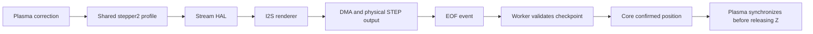

# Finite I2S step injection

This optional transport lets the secondary stepper execute a finite Z correction
through the ESP32 I2S sample stream while normal motion continues on other axes.
The first version supports finite Z corrections on classic ESP32 with the
MKS DLC32 V2 board map. The architecture document describes the target scope
and possible extensions.

## Architecture

The core secondary stepper shares a motion profile between the direct executor
and the stream executor. The stream executor submits an `injection_motion_t`
through `hal.stepper.injection`. The transport pulls timed events from `next`,
renders STEP/DIR samples and maintains checkpoints outside the DMA sample words.

An EOF interrupt queues descriptor identity, generation and epoch. The output task (`I2SOutTask`, function `i2sOutTask`)
validates the checkpoint and reports cumulative completed full pulses through
`notify`, outside the ISR and transport lock. The core keeps a motion active
while generated output is still draining; generated steps are not confirmed
steps. Application completion is deferred to the core foreground.



EOF is the accounting boundary, not a measurement of mechanical travel or the
precise time of every STEP edge. A controlled stop may finish before the original
requested endpoint. Cancellation/reset invalidates pending output rather than
reporting successful completion. The Plasma integration applies the confirmed
offset before releasing Z and does not synchronize a position marked invalid.

The profile remains private to core. `stepper_injection.h` defines the shared
contract. `i2s_injection.h` defines the driver renderer and checkpoint state.
The event generator runs under the driver lock and must not block, allocate or
call back into HAL. A motion context must remain valid through cancellation.

## Configuration

Use matching core and Plasma revisions from this series. Define
`STEP_INJECT_STREAM=1` consistently for all participating translation units,
with `STEP_INJECT_ENABLE=1`, classic ESP32 and `BOARD_MKS_DLC32_V2P0` selected.
Enabling `PLASMA_ENABLE` selects secondary-stepper injection in core driver
options. The existing driver configuration remains responsible for physical
inputs and outputs. This change does not select an ADC, modify machine settings
or change the default build environment.

The ESP32 build includes the renderer and, when the Plasma source is present,
the Plasma integration. With stream injection disabled, the renderer contributes
no stream implementation. Keep normal board-specific configuration in the
existing build configuration mechanism.

## Host regression tests

With Python 3 and a host C compiler, run from the ESP32 repository root:

```sh
python main/grbl/tests/stepper2/run.py --cc gcc
python tests/i2s_injection/run.py --cc gcc
python tests/i2s_injection/check_ownership.py --cc gcc
```

Clang and TinyCC can also be selected. The tests compile production C functions
against mock HAL dependencies and the real portable I2S renderer. They cover
finite profiles, direction and inversion, pulse tails at buffer boundaries,
confirmation, stale/duplicate checkpoints, stop/reset and ownership after a cut.
They do not emulate a complete ESP32, FreeRTOS scheduling or electrical timing.

The refactor passes 46,122 direct scenarios before and after the change with an
identical serviced trace (`17d7cd7b62360fa8`). The stream suite contains 771
scenarios. Physical measurement methodology and the firmware test environment
are separate follow-up parts of this series; these host results do not replace
those measurements. A complete firmware build is recorded in the
[test and measurement guide](../../doc/i2s-injection-testing.md#complete-firmware-build).

## Further documentation

See the [complete architecture](../../doc/i2s-injection.md) and [test and measurement guide](../../doc/i2s-injection-testing.md). Board-specific firmware fixtures are not bundled with these host tests.

The [simulation command reference](simulation-interface.md) records the historical test adapter and its planned use in subsequent test-environment PRs/releases; those commands are not registered by the current production commits.
